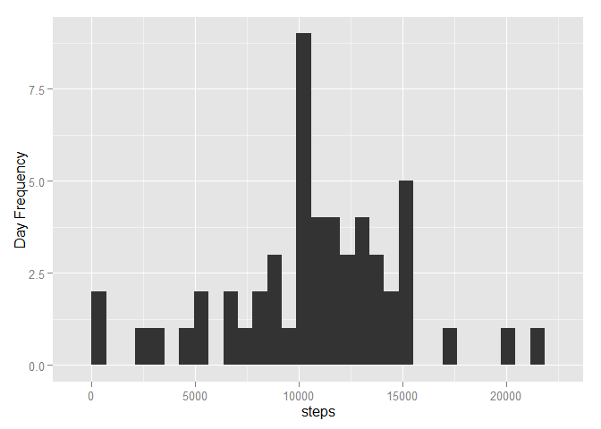
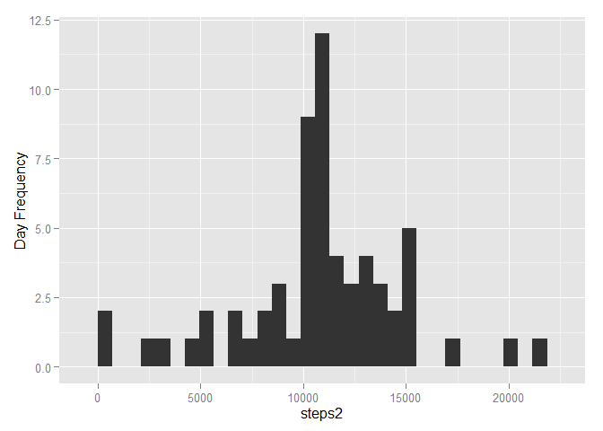
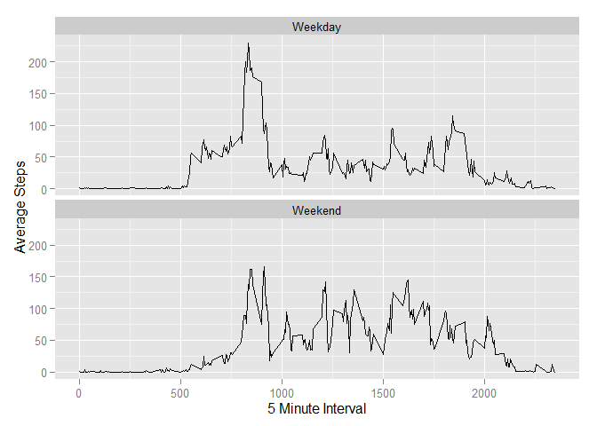

# Peer Assessment 1 - Reproducible Research
Jordan Spiegel  
Wednesday, April 15, 2015  
## Loading and preprocessing the data
First let's read in the Activity data set using the follownig code and load the dplyr package

```r
setInternet2(use = TRUE)
download.file( url="https://d396qusza40orc.cloudfront.net/repdata%2Fdata%2Factivity.zip", destfile="activity.zip")
unzip("activity.zip")
Activity_Full <- read.csv("activity.csv")
library (dplyr)
```

## What is mean total number of steps taken per day?
Next, we want to calculate the total number of steps per day. We will do this using the following code.

```r
Days <- group_by(Activity_Full,date)
TotStepsPerDay <- summarize(Days, steps= sum(steps))
```

Now that we have the total number of steps per day, we want to make a histogram of the data. We will load the ggplot2 package and then use the number of steps per day as our bins with the frequency of days on the y-axis


```r
library(ggplot2)
g <-ggplot(TotStepsPerDay,aes(steps ) )
g+geom_histogram()+labs(y="Day Frequency")
```

 

## What is the average daily activity pattern?
Next, we want to know the  mean and median of the total number of steps taken per day. We use the following code to get the output shown below.

```r
MeanTotStepsPerDay <- mean(TotStepsPerDay$steps, na.rm = TRUE)
        
print(MeanTotStepsPerDay)
```

```
## [1] 10766.19
```

```r
MedianTotStepsPerDay <- median(TotStepsPerDay$steps, na.rm = TRUE)

print(MedianTotStepsPerDay)
```

```
## [1] 10765
```

Next we want to make a time series plot (i.e. type = "l") of the 5-minute interval (x-axis) and the average number of steps taken, averaged across all days (y-axis)

We will start by resummarizing the data to get to the data we want to graph and then we will plot the data


```r
Intervals <- group_by(Activity_Full,interval)
IntervalsDay <- summarize(Intervals,stepsmean = mean(steps, na.rm = TRUE))
l <-ggplot(IntervalsDay,aes(interval,stepsmean ) )
l+geom_line()+labs(x= "5 Minute Interval", y = "Average Steps")
```

 

Now we want to know which 5-minute interval, on average across all the days in the dataset,contains the maximum number of steps?

To do this we will take the subset from above IntervalsDay data set which already has the average per interval and subset it to include the max number of steps


```r
maxsubset <- subset(IntervalsDay, stepsmean == max(stepsmean), select = )
print(maxsubset)
```

```
## Source: local data frame [1 x 2]
## 
##   interval stepsmean
## 1      835  206.1698
```

Next, we want to know the total number of missing values in the data set. We do this by doing the following:

```r
totalNAs<- sum(is.na(Activity_Full$steps))
print(totalNAs)
```

```
## [1] 2304
```

## Imputing missing values
Due to the number of missing values, we will now devise a strategy for filling in all of the missing values in the dataset. I will use the mean for intervals to fill in the missing values.

To do this we will create a new dataset that is equal to the original dataset but with the missing data filled in.

We do this with the folling code which merges the original activty_full dataset and the IntervalsDay data set, which gives an average of the number of steps across all days by interval. If the value is NA in the original data set steps category, we will fill it in with the mean, otherwise we will leave it alone. 


```r
Activity_Full2 <- merge(Activity_Full, IntervalsDay)
Activity_Full2$steps <- ifelse( is.na(Activity_Full2$steps),Activity_Full2$stepsmean, Activity_Full2$steps)
Activity_Full2$stepsmean <- NULL
```
For the imputed dataset we also cacluate the Total steps per day


```r
Days2 <- group_by(Activity_Full2,date)
TotStepsPerDay2 <- summarize(Days2, steps2= sum(steps))
```


Then we will again make a histogram with the imputed data set and also get the mean and median


```r
library(ggplot2)
g <-ggplot(TotStepsPerDay2,aes(steps2 ) )
g+geom_histogram()+labs(y="Day Frequency")
```

 


```r
MeanTotStepsPerDay2 <- mean(TotStepsPerDay2$steps, na.rm = TRUE)

print(MeanTotStepsPerDay2)
```

```
## [1] 10766.19
```

```r
MedianTotStepsPerDay2 <- median(TotStepsPerDay2$steps, na.rm = TRUE)

print(MedianTotStepsPerDay2)
```

```
## [1] 10766.19
```

Now we will want to know the difference between the non imputed and imputed total, mean, and median steps

```r
sum(TotStepsPerDay2$steps)-sum(TotStepsPerDay$steps,na.rm=TRUE)
```

```
## [1] 86129.51
```

```r
MeanTotStepsPerDay - MeanTotStepsPerDay2
```

```
## [1] 0
```

```r
MedianTotStepsPerDay - MedianTotStepsPerDay2
```

```
## [1] -1.188679
```


You can see here that when we impute data, 86129.5 more steps are taken across all days. Looking at it on an average daily basis , the means will be identical since
we are simply taking the average of the days amount to replace missing values. The median of the data only changes slightly.

## Are there differences in activity patterns between weekdays and weekends?
Next, we want to compare the imputed dataset by making a factor variable I will call weekday, which says whether the date is a weekday or weekend


```r
Activity_Full3 <- mutate(Activity_Full2, date = as.Date(Activity_Full2$date))
Activity_Full4 <- mutate(Activity_Full3, weekday = weekdays(Activity_Full3$date))
Activity_Full5 <- mutate(Activity_Full4, weekday = as.factor(ifelse(Activity_Full4$weekday %in% c("Saturday","Sunday"),"Weekend", "Weekday")))
```

Now that data set is created, make a time series plot


```r
Intervals5 <- group_by(Activity_Full5,interval, weekday)
IntervalsDay5 <- summarize(Intervals5,stepsmean = mean(steps))
l <-ggplot(IntervalsDay5,aes(interval,stepsmean ) )

l+geom_line()+facet_wrap(~weekday, nrow = 2, ncol = 1)+labs(x= "5 Minute Interval", y = "Average Steps")
```

 

From the graphs we can see that people generally start their days later on the weekends versus weekdays and in general more steps are taken in the weekdays.
